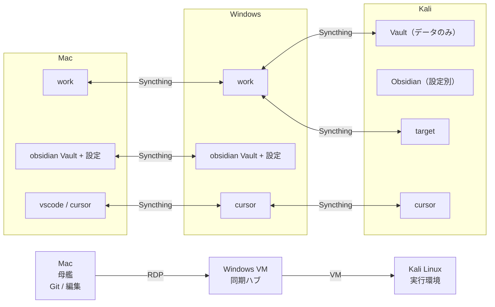
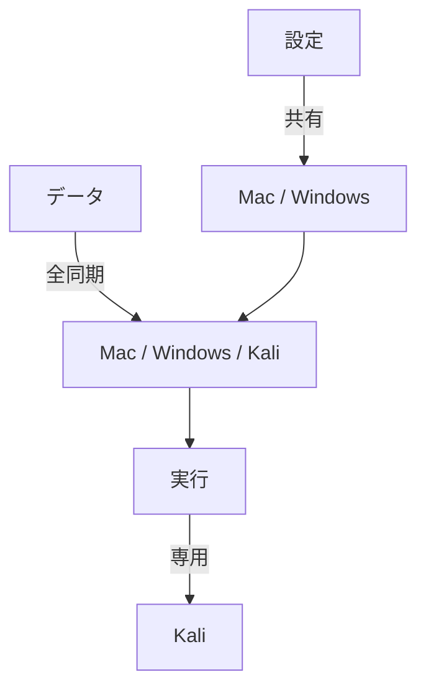

# Kali Setup

## 仮想基盤とOSの基本

| 項目 | 設定内容 |
| --- | --- |
| **プラットフォーム** | **VMware Workstation / Player** (公式推奨の安定性) |
| **イメージ** | Kali VMware 64-bit|
| **基本設定** | RAM: 8GB推奨, CPU: 2コア以上, グラフィックメモリ: 2GB, 3Dアクセラレータあり **日本語フォント** (`fonts-noto-cjk`) |

---

## 全体アーキテクチャ

```text
編集系（Mac / Windows）
→ Cursor / Obsidian / Git

実行系（Kali）
→ tmux / scan / enum / exploit

同期
→ Syncthing（データのみ）
```

---

## 設計思想（中核）

```text
設定は分離
データは共有
実行はKali
```

---

## ディレクトリ構成（Kali）

```text
~/Vault/Target/<IP>/
├── assets/
├── result/
│   ├── nmap_*
│   └── autorecon/
├── log/
├── <IP>.md
└── workbench -> ~/Workbench
```

---

## Workbench

```text
~/Workbench/
├── Recon/
├── Web/
├── AD/
├── Exploit/
├── Wordlists/
├── Scripts/
├── Tools -> ~/Tools
└── Transfer -> ~/Transfer
```

---

## セッション設計（tmux）

### セッション分離

```text
1 target = 1 session
```

例：

```text
meow_187
legacy_20
t_46_187
```

---

### ペイン構成

```text
[左]   scan   → target dir
[右上] enum   → ~/Workbench
[右下] notes  → target dir
```

---

### infra セッション（別）

```text
infra
├── VPN
├── HTTP server (pserv / updog)
├── pivot (ligolo / chisel)
└── Transfer作業
```

---

## フロー（実務）

```text
targettmux <IP> <name>
↓
scaninit
↓
ports-init / next / nextsvc
↓
手動列挙
↓
（並行）
fullcheck
↓
詰まったら
→ autorecon（手動）
→ UDP（必要時）
```

---

## スキャン設計

## 初動（scaninit）

```text
Rustscan
→ fallback: top1000
→ fallback: full scan
```

### サービススキャン

```text
nmap -sC -sV -p <ports>
```

### フルスキャン

```text
バックグラウンド実行
```

---

## 補助関数

### 重要

```text
target
targettmux
targetreset
infratmux
scaninit
ports-init / ports-serv
next / nextsvc
fullcheck
udp-fast
udp-top
udp-deep
getlist
setup_ligolo
fshot
shotdir
backconf
restoreconf
```

---

### 補助

```txt
refresh_oscp_prompt
vault-grep
tmuxsync
tmuxsync_precmd
extract_ports_gnmap
```

### 非自動（意図的）

```text
autorecon → 手動（TTY必要）
UDP       → 手動（ケース依存）
```

---

## alias

```zsh
# ---------------------------------------
# Aliases
# ----------------------------------------
alias ll='ls -alF'
alias gclone='cd ~/tools/git && git clone'
alias gup='find ~/Tools/Git -maxdepth 2 -name .git -type d -execdir git pull --rebase \;'
alias maintenance='sudo apt update && sudo apt dist-upgrade -y && gup && pipx upgrade-all'
alias pserv='python3 -m http.server 8000'
alias pserv80='sudo python3 -m http.server 80'
alias udot='updog -p 80'
alias icat='kitty +kitten icat'
alias vpnip="ip -br -4 a show tun0 | awk '{print \$3}' | cut -d/ -f1"
alias opentarget='xdg-open "$TARGET_DIR/$TARGET_IP.md"'
alias arlog='tail -f $OUT/autorecon/autorecon.log'
alias udp-open='grep -E "open|open\\|filtered" $OUT/nmap_udp_*.nmap 2>/dev/null'
alias ar='autorecon "$TARGET_IP" -o "$OUT/autorecon" > "$OUT/autorecon/autorecon.log" 2>&1'
alias ar_f_nmap='autorecon "$TARGET_IP" -p "$INIT_PORTS" -o "$OUT/autorecon_nmap" > "$OUT/autorecon_nmap/autorecon.log" 2>&1'
alias ar_f_nmap_full='ports=$(extract_ports_gnmap "$OUT/nmap_full.gnmap"); autorecon "$TARGET_IP" -p "$ports" -o "$OUT/autorecon_full" > "$OUT/autorecon_full/autorecon.log" 2>&1'
```

## Path

```zsh
# in the zshrc
# ----------------------------------------
# Paths
# ----------------------------------------
export WORDLISTS="$HOME/Workbench/Wordlists"
export USERS="$WORDLISTS/Usernames"
export PASSES="$WORDLISTS/Passwords"
export CREDS="$WORDLISTS/Credentials"
export DISCOVERY="$WORDLISTS/Discovery"
export ROCKYOU="$WORDLISTS/Passwords/rockyou.txt"
export SECLISTS="/usr/share/seclists"

alias cdword='cd $WORDLISTS'
alias cdusers='cd $USERS'
alias cdpass='cd $PASSES'
alias cdcreds='cd $CREDS'
alias cddisc='cd $DISCOVERY'
alias cdseclists='cd $SECLISTS'

# in the target function
export TARGET_IP="$ip"
export TARGET_NAME="$name"
export TARGET_DIR="$target_dir"
export workdir="$target_dir"
export OUT="$target_dir/result"
export LOG="$target_dir/log"
export ASSETS="$target_dir/assets"
export INIT_SCAN_SOURCE=""
export INIT_PORTS=""
```
## nextsvc の改善ポイント

```text
grep対象 = openポート行のみ
```

👉 誤検知防止（https問題解決）

---

## fullcheck

```text
実行中 → log表示
完了後 → openポート + 差分
```

---

## ログ戦略

```text
tmux-logging
→ 手動開始（現段階）
```

---

## 設定管理

### バックアップ

```zsh
buckconf
```

### 復元

```zsh
restoreconf
```

---

### config管理

```text
~/Vault/Cursor/40_Configs/
```

---

## シンボリックリンク戦略

```text
target → workbench
workbench → Tools / Transfer
```

👉 二重リンクは作らない（冗長回避）

---


## システムの基本更新と日本語化

1. **システム更新:**
```zsh
# パッケージの更新と不要な依存関係の削除、キャッシュの整理を一括で行う
sudo apt update && sudo apt full-upgrade -y
sudo apt autoremove -y && sudo apt autoclean -y
```

2. **日本語フォント（文字化け防止）**
```zsh
sudo apt install -y fonts-noto-cjk

```

3.  **電源管理（スリープ・ロック禁止）**

長時間のスキャンを中断させないための必須設定です。

```zsh
gsettings set org.gnome.desktop.screensaver lock-enabled false
gsettings set org.gnome.desktop.session idle-delay 0
xset s off -dpms s noblank

```

4. **自動サスペンドOFF**

```zsh
sudo systemctl mask sleep.target suspend.target hibernate.target hybrid-sleep.target
```

GUIでも設定しないと機能しないかも

- settings manager → xfxe screensaver
  - Enable ScreensaverとEnable Lock Screenのスイッチを切る

---

## ディレクトリ構造の作成（整理のルール化）

## 全体構成図（操作＋同期）



---

## 設計思想



---

| カテゴリ   | ディレクトリパス                                                    | 用途                                  |
| :----- | :---------------------------------------------------------- | :---------------------------------- |
| **記録** | `~/Vault/Target/$ip/{assets,result,log}`                    | Obsidian管理。スクショ、Nmap結果、tmuxログ       |
| **倉庫** | `~/Tools/{Git,Python,C#,Powershell,Bin}`                    | オリジナルツールの保管庫。ここからコピーして使う            |
| **作業** | `~/Workbench/{Recon,AD,Web,Exploit,Wordlists,Verification}` | Kaliローカルで実行するツール群                   |
| **配送** | `~/Transfer/{RevShell,PrivEsc,PostEx,Pivoting}`             | ターゲットへ送る用。内部に **Linux/Windows** を作成 |


```zsh
mkdir -p ~/Vault/Target \
         ~/Tools/{Git,Python,Powershell,Shell,Bin} \
         ~/Workbench/{Recon,AD/enumeration,AD/attacks,Web/sqli,Exploit,Wordlists,Verification} \
         ~/Transfer/{RevShell,PrivEsc,PostEx,Pivoting}/{Linux,Windows}

# 確認用
ls -R ~/Vault ~/Tools ~/Workbench ~/Transfer

```

Windows側のCursorで管理しているので下記のディレクトリはシンボリックリンク

```zsh
ln -sfn /home/kali/Vault/Cursor/10_Scripts/shell /home/kali/Tools/Shell
ln -sfn /home/kali/Vault/Cursor/10_Scripts/python /home/kali/Tools/
ln -sfn /home/kali/Vault/Cursor/10_Scripts/Powershell /home/kali/Tools/
```

---

## pipxのインストール

```bash
sudo apt install -y pipx && pipx ensurepath

```

## Docker

### インストール

```zsh
#  システム更新
sudo apt update && sudo apt upgrade -y

sudo apt install -y docker.io
sudo systemctl enable docker --now
sudo usermod -aG docker $USER
newgrp docker

docker --version
docker run hello-world

# Compose確認
docker compose version
```

- `docker-compose` は旧式

**composeがインストールされていなかった場合**

```zsh
# 1. プラグイン用のディレクトリを作成
mkdir -p ~/.docker/cli-plugins/

# 2. 最新のバイナリをダウンロード (2026年時点の最新版を想定)
curl -SL https://github.com/docker/compose/releases/latest/download/docker-compose-linux-x86_64 -o ~/.docker/cli-plugins/docker-compose

# 3. 実行権限を与える
chmod +x ~/.docker/cli-plugins/docker-compose

# 4. 確認
docker compose version
```

---
### よくあるトラブル

#### 権限エラー

```bash
permission denied ...
```

→ dockerグループ追加 or 再ログイン

---

#### Dockerが起動しない

```bash
sudo systemctl restart docker
sudo systemctl status docker
```

---

## ターミナルのカスタマイズ

### shellの確認

shellの確認
```zsh
echo $SHELL
```

#### bashだった場合 (/etc/passwdは/bin/zshに切り替わるがターミナルはbashのままだった)

zshに切り替え(一時的)
```zsh
chsh -s /bin/zsh
zsh
```
zshに切り替え(永続的)
```zsh
sudo chsh -s /bin/zsh kali
sudo reboot
```

### ターミナルの変更

```zsh
sudo apt update
sudo apt install kitty -y
# Kitty を選択肢としてシステムに登録
sudo update-alternatives --install /usr/bin/x-terminal-emulator x-terminal-emulator /usr/bin/kitty 50
# 番号のリストが表示されるので、kitty の番号を入力して Enter
sudo update-alternatives --config x-terminal-emulator
# fontのインストール
gclone https://github.com/ryanoasis/nerd-fonts.git ~/Tools/Git/nerd-fonts
cd ~/Tools/Git/nerd-fonts

# フォントのインストール
mkdir -p ~/.local/share/fonts
cd /tmp
wget https://github.com/ryanoasis/nerd-fonts/releases/latest/download/JetBrainsMono.zip
unzip JetBrainsMono.zip -d JetBrainsMono
cp JetBrainsMono/*.ttf ~/.local/share/fonts/
fc-cache -fv
fc-list | grep "JetBrainsMono"

```

### shellの拡張機能のインストール

#### **zoxide**

```zsh
sudo apt install zoxide
# ~/.zshrcに反映（個別で実施する場合）
# echo 'eval "$(zoxide init zsh)"' >> ~/.zshrc
# source ~/.zshrc
# 使い方: z oscp  (これで ~/Documents/OSCP/work/ に飛んだりできる)
# ※一度移動する必要あり
# 使い方: zi   fzf を使って、記憶されたディレクトリの一覧からインタラクティブに選択して移動
```

#### **fzf**

```zsh
sudo apt install fzf
# ~/.zshrcに反映（個別で実施する場合）
# echo 'source <(fzf --zsh)' >> ~/.zshrc
# source ~/.zshrc
# fzf のプレビュー機能を有効化（ファイルの中身を見ながら検索）
export FZF_DEFAULT_OPTS="--height 40% --layout=reverse --border --preview 'cat {} | head -50'"
# 履歴検索 (Ctrl+R) のときもプレビューを出す（打ったコマンドの全体像が見える）
export FZF_CTRL_R_OPTS="--preview 'echo {}' --preview-window down:3:hidden:wrap --bind '?:toggle-preview'"
# 使い方: Ctrl + R: コマンド履歴を検索
# 使い方: Alt + C: フォルダ（ディレクトリ）を曖昧検索して移動
```

#### **Zshプラグイン:** `zsh-autosuggestions` と `zsh-syntax-highlighting` を有効化。

```zsh
sudo apt install zsh-autosuggestions
sudo apt install zsh-syntax-highlighting
# ~/.zshrcに反映（個別で実施する場合）
# echo "source /usr/share/zsh-autosuggestions/zsh-autosuggestions.zsh" >> ~/.zshrc
# echo "source /usr/share/zsh-syntax-highlighting/zsh-syntax-highlighting.zsh" >> ~/.zshrc
# source ~/.zshrc
```

#### ~/.zshrcの編集

##### alias llとHISTSIZEとSAVEHISTの編集

```zsh

sed -i -e "s/^alias ll='ls -l'/alias ll='ls -alF'/" \
       -e "s/^HISTSIZE=1000$/HISTSIZE=10000/" \
       -e "s/^SAVEHIST=2000$/SAVEHIST=10000/" ~/.zshrc

# 書き換え内容の確認
grep -E "alias ll|HISTSIZE|SAVEHIST" ~/.zshrc

# 設定の反映
source ~/.zshrc
```

### **tmux**のインストール

```zsh
sudo apt install tmux
```

#### **Tmux プラグインマネージャー (TPM) の導入**

* **インストール:**

```zsh
git clone https://github.com/tmux-plugins/tpm ~/.tmux/plugins/tpm
```

#### `~/.tmux.conf` の作成

#### **拡張機能の反映**

**Tmux内で `Prefix (Ctrl+a)` -> `I` (大文字) を押すとインストール**


### ターミナルのコンフィグ更新

#### zshrcに更新機能を追加

```zsh
cat << 'EOF' >> ~/.zshrc
# -----------------------------

# Buckup Config

# -----------------------------

backconf() {

local base="$HOME/Vault/Cursor/40_Configs"

local ts=$(date +%Y-%m-%d_%H-%M-%S)

local dest="$base/$ts"

  

mkdir -p "$dest"

  

echo "[*] Backing up configs → $dest"

  

cp "$HOME/.zshrc" "$dest/zshrc"

cp "$HOME/.tmux.conf" "$dest/tmux.conf"

cp "$HOME/.config/kitty/kitty.conf" "$dest/kitty.conf"

  

echo "[+] Backup completed"

}

  

# -----------------------------

# Restore Config

# -----------------------------

restoreconf() {

local src="$HOME/Vault/Cursor/40_Configs"

local ts=$(date +%Y-%m-%d_%H-%M-%S)

local backup="$HOME/.config_backup/$ts"

  

mkdir -p "$backup"

  

echo "[*] Backup current configs → $backup"

  

[ -f "$HOME/.zshrc" ] && cp "$HOME/.zshrc" "$backup/zshrc"

[ -f "$HOME/.tmux.conf" ] && cp "$HOME/.tmux.conf" "$backup/tmux.conf"

[ -f "$HOME/.config/kitty/kitty.conf" ] && cp "$HOME/.config/kitty/kitty.conf" "$backup/kitty.conf"

  

echo "[*] Restoring configs from $src"

  

cp "$src/zshrc" "$HOME/.zshrc"

cp "$src/tmux.conf" "$HOME/.tmux.conf"

cp "$src/kitty.conf" "$HOME/.config/kitty/kitty.conf"

  

echo "[+] Restore completed"

echo "[!] Backup saved: $backup"

echo "[!] Run: source ~/.zshrc"

}
EOF
```

#### 更新機能の実行

```zsh
# ｿｰｽの更新
source ~/.zshrc

# ﾊﾞｯｸｱｯﾌﾟの実施
backconf

# ｺﾝﾌｨｸﾞの更新 "$HOME/Vault/Cursor/40_Configs"に更新するｺﾝﾌｨｸﾞがあるか確認（zshrc,tmux.conf,kitty.conf）
restoreconf
source ~/.zshrc
```
## スクリーンショットのカスタマイズ

### **flameshot**

* **General**
* Save image after copy

* 保存ファイル名の自動化（超重要）

  デフォルトでは `screenshot.png` のような名前になりますが、これを**「日時」**に変更することで、作業ログ（Obsidian等）との時系列が一致しやすくなります。

  * **設定方法:** `Flameshot Config` > `Filename Editor`
  * **おすすめ設定:** `%Y-%m-%d_%H-%M-%S`
  * これで `2026-03-13_16-00-00.png` のように保存され、証拠の整理が劇的に楽になります。

* インターフェースとツールの最適化

  試験中は「矢印」と「ぼかし（隠蔽）」、「テキスト」を多用します。

  * **UI設定:** `General` > `Show help message` をオフにする（邪魔なため）。
  * **ボタンの選択:** `Interface` タブで、以下のツールだけを表示するように絞ると、ツールバーがスッキリします。
    * **矢印 (Arrow):** 注目ポイントを指す。
    * **矩形 (Rectanglar Selection):** 重要な文字列を囲む。
    * **ぼかし (Pixelate):** VPNのIPやパスワードなど、報告書に載せたくない情報を隠す。
    * **テキスト (Text):** 補足説明を入れる。
    * **保存 (Save) & コピー (Copy to Clipboard):** クリップボードコピーをメインにするとObsidianへの貼り付けが速いです。

* ショートカットキーの割り当て

  OSCPでは「キャプチャを撮る」動作を何百回も繰り返します。マウス操作ではなくキーボード一発で起動させましょう。

1. **起動確認:**
ターミナルで `flameshot gui` を実行し、範囲選択ができるか確認します。
2. **ショートカット登録 (重要):**
Kaliの [Settings] > [Keyboard] > [Application Shortcuts] から、以下のショートカットを登録すると効率が劇的に上がります。
* **Command:** `flameshot gui`
* **Shortcut:** `Print` キー（または好みのキー）

## Workbench

### ~/Workbench/Wordlists

```zsh
# ディレクトリ作成
~/Workbench/Wordlists/{Discovery,Usernames,Passwords,Credentials,Fuzzing}
ln -sfn "$HOME/Transfer/" "$HOME/Vault/Target/Transfer"
ln -sfn "$HOME/Tools" "$HOME//Workbench/Tools"

# rockyou をコピーして解凍（OS標準の場所を汚さない）
cp /usr/share/wordlists/rockyou.txt.gz ~/Workbench/Wordlists/Passwords/
gunzip ~/Workbench/Wordlists/Passwords/rockyou.txt.gz
```

Kaliにプリインストールされている膨大なリストの中から、主要なものを選択

```zsh
ln -sfn $SECLISTS/Discovery/Web-Content/common.txt $DISCOVERY/web-common.txt
ln -sfn $SECLISTS/Discovery/Web-Content/DirBuster-2007_directory-list-2.3-medium.txt $DISCOVERY/dir-medium.txt
ln -sfn $SECLISTS/Discovery/Web-Content/raft-medium-files.txt $DISCOVERY/raft-files.txt
ln -sfn $SECLISTS/Discovery/Web-Content/raft-medium-directories.txt $DISCOVERY/raft-dir.txt
ln -sfn $SECLISTS/Discovery/DNS/subdomains-top1million-110000.txt $DISCOVERY/dns-110k.txt
ln -sfn $SECLISTS/Discovery/DNS/subdomains-top1million-5000.txt $DISCOVERY/dns-5k.txt

ln -sfn $SECLISTS/Usernames/top-usernames-shortlist.txt $USERS/users-short.txt
ln -sfn $SECLISTS/Usernames/xato-net-10-million-usernames.txt $USERS/users-10m.txt

ln -sfn $SECLISTS/Passwords/Default-Credentials/default-passwords.txt $PASSES/default-creds.txt
ln -sfn $SECLISTS/Passwords/Default-Credentials/default-passwords.csv $PASSES/default-creds.csv
ln -sfn $SECLISTS/Fuzzing/login_bypass.txt $PASSES/login_bypass.txt

ln -sfn $SECLISTS/Fuzzing/LFI/LFI-Jhaddix.txt $WORDLISTS/Fuzzing/lfi.txt
ln -sfn $SECLISTS/Fuzzing/Databases/SQLi/Generic-SQLi.txt $WORDLISTS/Fuzzing/sqli.txt
ln -sfn $SECLISTS/Miscellaneous/Web/http-request-headers/http-request-headers-common-non-standard-examples.txt $WORDLISTS/Fuzzing/bypass-waf.txt
ln -sfn $SECLISTS/Fuzzing/XSS/robot-friendly/XSS-Cheat-Sheet-PortSwigger.txt $WORDLISTS/Fuzzing/XSS-Cheat-Sheet-PortSwigger.txt

```

### 「コピー元」と「編集済み」の区別

`Tools` から `Workbench/Exploit` にコピーした際、ファイル名にターゲットの識別子（IPの末尾など）を付ける癖をつけると、後で「どの設定で投げたか」が明白になります。

* **元ファイル:** `~/Tools/Python/exploit_db_12345.py`
* **コピー後:** `~/Workbench/Exploit/exploit_101.py` （10.10.10.101用）

### 書き換え箇所の検索（grep）
コピーしたコード内のどこを書き換えるべきか探すとき、以下のキーワードで `grep` すると、編集が必要な箇所（IP/Port/URL）を素早く見つけられます。

```bash
grep -Ei 'ip|port|addr|url|http' exploit_101.py
```

## VSCode

- もともと入っているOSS版ではなくMicrosoftのﾘﾎﾟｼﾞﾄﾘから安定版を入手

```zsh
# 依存パッケージのインストール
sudo apt update
sudo apt install -y software-properties-common apt-transport-https curl

# MicrosoftのGPGキーを登録
curl -sSL https://packages.microsoft.com/keys/microsoft.asc | gpg --dearmor | sudo tee /usr/share/keyrings/microsoft-archive-keyring.gpg > /dev/null

# 公式リポジトリをリストに追加
echo "deb [arch=amd64 signed-by=/usr/share/keyrings/microsoft-archive-keyring.gpg] https://packages.microsoft.com/repos/vscode stable main" | sudo tee /etc/apt/sources.list.d/vscode.list
sudo apt update
sudo apt install code
```

## Firefox

### 拡張機能一覧

| アドオン名                                | 用途               | 特徴                                                               |
| :----------------------------------- | :--------------- | :--------------------------------------------------------------- |
| **FoxyProxy Standard**               | プロキシ切り替え         | Burp Suiteへの通信転送を1クリックでON/OFFできる。                                |
| **Wappalyzer**                       | 技術スタック特定         | CMS（WordPress等）やOS、Webサーバの種類を瞬時に把握。                              |
| **HackTools**                        | **オールインワン攻撃ツール** | **最優先で導入すべき。** リバースシェルのコマンド生成、XSS/SQLiペイロード、ハッシュ計算などが開発者ツール内で完結。 |
| **OWASP PTK**                        | **高度な解析・スキャン**   | Wappalyzerの強化版＋簡易的なBurp機能。R-Attacker（リクエスト再送）やIースト（脆弱性検知）が可能。    |
| **Cookie Editor**                    | クッキー編集           | セッションハイジャックやクッキーベースの権限昇格テストに。UIが非常に使いやすい。                        |
| **User-Agent Switcher**              | UA偽装             | 「モバイル版のみ脆弱」なケースや、特定のブラウザ制限を回避する際に使用。                             |
| **Firefox Multi-Account Containers** | セッション分離          | 管理者と一般ユーザーで同時にログインし、権限昇格（IDOR）を効率よくテストできる。                       |
| **Trufflehog**                       | ソースコード検索         | ソースコードの中にうっかり残された機密情報（パスワードやAPIキーなど）を見つけ出す                       |
| **Shodan**                           | Network情報        | 現在のﾍﾟｰｼﾞのShodan結果を表示                                             |
| **SingleFile**                       | HTML保存           | SingleFileは、ページ全体（CSS、画像、フォント、フレームなど）を単一のHTMLファイルとして保存する         |

### 拡張機能を利用したWeb調査の流れ

* **ソースコード (`Ctrl + U`):** 開発者のコメントや、隠しディレクトリのヒントがないか？
* **開発者ツール (`F12`):** コンソールにエラーが出ていないか？ `Network` タブで変なAPIを叩いていないか？
* **アドオン (`HackTools`):** 常に横に開いておき、エンコード（URL, Base64）が必要な時にすぐ使う。

#### ステップ1：パッシブ偵察（触れる前に知る）
サイトを開いた瞬間、アドオンが自動で情報を集めてくれます。

1.  **Wappalyzer / OWASP PTK を確認**
    * **OS/Webサーバ:** `Ubuntu`, `Apache 2.4.41` など。
    * **言語/フレームワーク:** `PHP 7.4`, `WordPress 5.8`, `Laravel` など。
    * **重要:** バージョン番号が見えたら、即座に `searchsploit [名前] [バージョン]` で既知の脆弱性（RCEなど）がないか調べます。
2.  **Dotpyle / BuiltWith（オプション）**
    * インフラ構成（CDNやWAFの有無）を確認。

---

#### ステップ2：アクティブ探索（構造を暴く）
ブラウザで見える範囲の裏側を覗きます。

1.  **Cookie Editor でセッション確認**
    * `session_id` が単なる数字（1, 2...）や、Base64でデコード可能な値ではないか？
    * `admin=false` のような露骨なフラグがないか？
2.  **Container Tabs で権限テスト準備**
    * 「タブA（一般ユーザー）」と「タブB（管理者）」を別色で開き、一般ユーザーのURL（例：`/user/profile/10`）を管理者のタブで叩いて、他人の情報が見えないか（IDOR）を確認。

---

#### ステップ3：HackTools による「仕込み」と「攻撃」
F12キーで **HackTools** タブを開き、攻撃コードを生成します。

1.  **入力フォームを見つけたら（XSS/SQLi）**
    * HackTools の `XSS` または `SQL Injection` セクションから、定番のペイロード（`<script>alert(1)</script>` 等）をコピーして投げ込みます。
2.  **ファイルアップロード機能があったら（Reverse Shell）**
    * HackTools の `Reverse Shell` セクションで、自分のIP（`tun0`）とポート（例：4444）を入力。
    * `PHP Pentestmonkey` などのコードを生成し、`.php` ファイルとして保存してアップロードを試みます。

---

#### ステップ4：Burp Suite による精密射撃（Repeater）
ブラウザでの挙動に「違和感」を感じたら、通信を Burp に固定して深掘りします。

1.  **通信をキャプチャ**
    * FoxyProxy を `Burp` に切り替え。
    * ログインや検索など、怪しいアクションを実行。
2.  **Repeater へ転送 (`Ctrl + R`)**
    * Burp の `HTTP history` から対象のリクエストを選び、Repeater へ送る。
    * **ここで試すこと:**
        * パラメータを消してみる（エラーから情報漏洩しないか）。
        * 数値を大きく変えてみる（境界値テスト）。
        * `User-Agent` を `HackTools` で生成した特殊なものに変えてみる（シェルショック攻撃など）。

---

#### ステップ5：証跡の記録（Obsidianへ）
脆弱性を見つけたら、即座に記録します。

1.  **Flameshot で撮影**
    * `PrintScreen` で「ブラウザのURL」「HackToolsのペイロード」「Burpのレスポンス（成功の証拠）」を一枚に収めるようにキャプチャ。
2.  **Obsidian に貼り付け**
    * 設定した `current_assets` フォルダに自動保存されるので、そのまま考察をメモ。


---


### FoxyProxy

#### 1. Burp Suite 側の準備
まず、Burpが通信を待ち受けているか確認します。
1. Burp Suite を起動し、`Proxy` タブ > `Proxy Settings` を開きます。
2. `Proxy Listeners` に `127.0.0.1:8080` があり、`Running` にチェックが入っていることを確認します。

---

#### 2. FoxyProxy の設定（Firefox）
FirefoxからBurpへ通信を投げるための「スイッチ」を作ります。
1. Firefoxの右上の **FoxyProxyアイコン** をクリックし、`Options` を開きます。
2. `Proxies` タブで `Add` を押し、以下の内容で保存します。
   - **Title:** `Burp`
   - **Proxy Type:** `HTTP`
   - **Proxy IP:** `127.0.0.1`
   - **Port:** `8080`
3. アイコンをクリックし、今作った `Burp` を選択します。

---

#### 3. CA証明書のインポート（最重要：HTTPS通信の解読）
このままだと `https://` で始まるサイト（Googleなど）にアクセスした際、「潜在的なセキュリティリスク」と警告が出て通信が見れません。Burpの証明書をFirefoxに信頼させる必要があります。

1. FoxyProxyで `Burp` を **ON** にします。
2. Firefoxのアドレスバーに `http://burp` と入力してアクセスします。
3. 右上の **「CA Certificate」** をクリックして `cacert.der` をダウンロードします。
4. Firefoxの設定（Settings）を開き、検索欄に **「Certificates」** と入力。
5. **「View Certificates...」** ボタンを押し、`Import...` をクリック。
6. 先ほどダウンロードした `cacert.der` を選択します。
7. 出てきたチェックボックスの **「Trust this CA to identify websites（この認証局によるウェブサイトの識別を信頼する）」** に必ずチェックを入れて OK を押します。

---

#### 4. 動作確認フロー
設定が完了したら、以下の流れでテストしてください。

1. **Burp:** `Proxy` > `Intercept` タブで `Intercept is on` になっているか確認。
2. **Firefox:** 適当なサイト（例：`http://example.com`）にアクセス。
3. **結果:** Firefoxが読み込み状態で止まり、Burpにリクエストの内容（GET / HTTP/1.1...）が表示されれば成功です！
4. **操作:** Burpの `Forward` を押せば通信がサイトへ飛び、Firefoxに画面が表示されます。

### Burp

#### 運用

* **基本**
  * **Repeater:** 1つのリクエストを何度も手動で書き換えて試す（本命）。
  * **Intruder:** 単語リストを使ってログイン試行やディレクトリ列挙を自動化する（補助）。


##### 1. Repeater (Ctrl + R) の黄金ルーチン

Repeaterは、キャプチャしたリクエストを「何度でも、手動で書き換えて再送信」できる場所です。

1.  **リクエストの転送:**
    `Proxy` > `HTTP history` で「お、この通信怪しいな（ログイン、検索、ファイル操作など）」と思ったら、即座に **`Ctrl + R`**。
2.  **タブの整理:**
    Repeaterタブが `1, 2, 3...` と増えていくので、タブをダブルクリックして名前を付けます（例: `Login_SQLi`, `File_Upload_Bypass`）。
3.  **試行錯誤のサイクル:**
    - パラメータの値を書き換える。
    - **`Send`** ボタン（または `Ctrl + Space`）を押す。
    - **`Response`** パネルで、変化（エラーメッセージ、ログイン成功、実行結果など）を確認。

---

##### 2. HackTools × Burp Repeater の連携

ブラウザのアドオン **HackTools** は、Repeaterに貼り付ける「弾丸（ペイロード）」を作る工場になります。

* **ケースA: SQLインジェクション (SQLi)**
    1.  HackToolsで `SQL Injection` タブを開き、`Auth Bypass` などのペイロードを選択。
    2.  Burp Repeaterの `id=` や `username=` のあとに貼り付け。
    3.  `Send` して、レスポンスに「Welcome admin」などが出ないかチェック。
* **ケースB: リバースシェル (RCE)**
    1.  HackToolsの `Reverse Shell` で自分のIP/Portを入力し、PHPやPythonのワンライナーを生成。
    2.  Burp Repeaterのパラメータ部分に貼り付け。
    3.  **重要:** 貼り付けた後、文字列を選択して **`Ctrl + U` (URL Encode)** を実行。
        - スペースや `&` 記号がそのまま送られると、リクエストが壊れるため。


---

##### 3. 証跡の残し方 (Obsidian連携)

「脆弱性を見つけた！」という瞬間、以下の2枚のスクショをセットで残すのがOSCPレポートの鉄則です。

1.  **Request:** どんな「悪いリクエスト」を送ったか（ペイロードが見える状態）。
2.  **Response:** その結果、どんな「証拠」が返ってきたか（`/etc/passwd` の中身や、管理者権限でのログイン成功画面）。

> [!TIP]
> **Flameshotの「矩形囲み」を多用せよ**
> スクショを撮る際、Burpの画面全体を撮るのではなく、**「書き換えたパラメータ」**と**「特徴的なレスポンス結果」**を赤枠で囲むと、採点官に伝わりやすい（＝得点に繋がりやすい）レポートになります。

---

#### 設定

##### 1. プロキシ・リスナーの設定 (Proxy Settings)
ブラウザとの連携を盤石にします。

* **127.0.0.1:8080:** デフォルトでOKですが、他のツールと競合する場合はポートを変えます。
* **Support invisible proxying:** もし厚いプロキシ環境下や特殊なクライアントアプリを解析する場合は、ここをONにすることがありますが、通常のブラウザ操作ならOFFでOKです。

---

##### 2. ターゲット・スコープの設定 (Target Scope)
**これが最も重要です。** 無関係な通信（Googleの更新確認、OSのテレメトリなど）を排除します。

1.  ターゲットのURL（例：`http://10.10.10.123`）にアクセス。
2.  `Target` > `Site map` でそのURLを右クリックし、**「Add to scope」** を選択。
3.  `Proxy` > `HTTP history` を開き、上部の **Filterバー** をクリック。
4.  **「Show only in-scope items」** にチェックを入れて `Apply`。
    * これで、ターゲット以外の通信が履歴から消え、画面がスッキリします。

---

##### 3. レスポンスの自動表示 (Response Modification)
OSCPでは、隠しフィールドや無効化されたボタンが突破口になることがよくあります。

* **`Proxy` > `Proxy Settings` > `Response Modification`:**
    * `Unhide hidden form fields`: 隠しパラメータ（`<input type="hidden">`）を可視化。
    * `Enable disabled form fields`: グレーアウトされたボタンや入力を有効化。
    * `Remove input field length limits`: 文字数制限を解除。
    * これらをONにしておくと、ブラウザ上でそのまま「悪意のある入力」を試せるようになります。

---

##### 4. プロジェクトの保存とバックアップ (Dashboard)
試験中にBurpがクラッシュすると悲惨です。

* **Pro版の場合:** プロジェクトファイル（`.burp`）を、作成した `~/Vault/Target/$ip/result` 内に保存するよう設定してください。
* **Community版の場合:** プロジェクトの保存ができないため、**「面白いリクエストを見つけたら即座にRepeaterに送る（Ctrl+R）」** 癖をつけてください。Repeaterの内容はアプリを閉じない限り保持されます。

---

##### 5. 表示フォントの調整 (User Interface)
HTTPリクエストの改行や特殊文字を見逃さないための設定です。

* **`Settings` > `User Interface` > `Display`:**
    * **Size:** 14px 程度に大きくすると、長時間でも目が疲れにくくなります。

---

##### 7. Extensions（拡張機能）の導入
`Extensions` > `BApp Store` から以下の2つを入れておくのが鉄板です。

1.  **Logger++:** `HTTP history` よりも詳細なログを確認できます。
2.  **Autorize:** 権限昇格（一般ユーザーが管理者の機能を叩けるか）の自動チェックに役立ちます。

#### **Tips**
* **Intercept は基本 OFF にしておく:**
  常に通信を止めているとブラウザが重くて調査が進みません。通常は `Intercept is off` にしておき、`HTTP history` タブで流れる通信を眺めるスタイルが効率的です。「ここぞ」というリクエスト（ログインボタンを押す瞬間など）だけ `Intercept on` にします。
* **ターゲットを Scope に追加する:**
  `Target` > `Scope` にターゲットのIPを追加し、`Proxy` > `HTTP history` のフィルタで `Show only in-scope items` を有効にします。こうすると、背景で動いている不要な通信（Googleの更新確認など）が消え、ターゲットの通信だけに集中できます。
* **Repeater への転送 (Ctrl + R):**
  Historyで見つけた面白いリクエストは、すぐに `Ctrl + R` で Repeater に送りましょう。そこでパラメータを書き換えて何度も試行錯誤するのが、脆弱性発見の王道です。
  * **Inspector パネルの活用:**
  画面右側の `Inspector` パネルを使うと、URLデコードされた状態でパラメータを編集できます。複雑なペイロードを入れる時にミスが減ります。
* **Render タブの確認:**
    Responseパネルの `Render` タブを押すと、サーバーからの返信を「ブラウザで見た時」に近い状態で表示してくれます。SQLiで画面が崩れた時や、成功時の画面変化を視覚的に捉えるのに便利です。
* **Target Scope の徹底:**
    前述の `Show only in-scope items` を設定していないと、Repeaterに送るべき「本物の通信」を探すだけで時間をロスします。必ず設定しましょう。

## トラブルシューティング

### 依存関係エラー

**症状:** `apt upgrade` や `apt install` で止まる、依存関係の unmet が出る
**原因:** パッケージのバージョン衝突、古い/破損パッケージ
**解決策:**

```zsh
sudo apt --fix-broken install       # 自動修復
sudo dpkg --configure -a            # 未設定パッケージの設定
sudo apt autoremove                 # 不要なパッケージ削除
sudo apt clean                      # キャッシュ削除

# 競合が残る場合は古いパッケージを削除
dpkg --remove --force-remove-reinstreq <package>
# 削除できない場合は強制削除
sudo dpkg --purge --force-depends <package>
```

⚠️ 競合が残る場合は古いパッケージを `dpkg --remove --force-remove-reinstreq <package>` で削除してから再インストール。

---

### リポジトリ・アップデートの失敗

**症状:**

```text
The following signatures couldn't be verified because the public key is not available: NO_PUBKEY <KEYID>
```

**原因:** Kali リポジトリの署名鍵が古い、または更新されていない
**解決策:**

```zsh
# 署名鍵の更新
sudo wget https://archive.kali.org/archive-keyring.gpg -O /usr/share/keyrings/kali-archive-keyring.gpg
sudo apt update

# リリース情報の変更を明示的に許可して更新
sudo apt update --allow-releaseinfo-change

# 標準の sources.list を強制再生成（中身が壊れている場合）
echo "deb http://http.kali.org/kali kali-rolling main contrib non-free non-free-firmware" \
| sudo tee /etc/apt/sources.list
sudo apt update
```

---

### パッケージの途中で止まる / 中途半端にインストールされる

**症状:**

```text
dpkg: error processing package ... (--configure):
```

**原因:** インストールやアップグレードが途中で失敗
**解決策:**

```zsh
sudo dpkg --configure -a           # 未設定のパッケージを設定
sudo apt install -f                # 依存関係修復
```

---

### リポジトリの古い URL / 無効なリポジトリ

**症状:** `apt update` で 404 エラーや「Failed to fetch」
**原因:** sources.list の URL が古い、または Kali Rolling に対応していない
**解決策:** `/etc/apt/sources.list` を公式リポジトリに更新

```text
deb http://http.kali.org/kali kali-rolling main non-free contrib
```

その後：

```zsh
sudo apt update
```

---

### パッケージキャッシュの破損

**症状:** パッケージのダウンロードやインストールが途中で止まる
**解決策:**

```zsh
sudo apt clean
sudo apt autoclean
sudo apt update
```

---

### ディスク容量不足

**症状:** 「No space left on device」やインストールが止まる
**解決策:**

```zsh
sudo apt autoremove
sudo apt clean
df -h   # 容量確認
```

必要なら古いカーネルやログを削除。

---

### ネットワークアダプタの不調

**症状:** `target` に ping が飛ばない、VPNは繋がっているのに通信できない。

**原因:** VMwareの仮想アダプタ（vmnet）のハングアップ。

**解決策:**

* **ホスト側:** VMwareの「Virtual Network Editor」で [Restore Defaults] を実行。
* **ゲスト側:** ネットワークマネージャーの再起動。
```zsh
sudo systemctl restart NetworkManager

```

### マウスカーソルが消失する - 仮想マシンの互換性に問題

**症状:** VMware環境で、ゲストOS内にマウスカーソルが表示されなくなる。

**原因:** VMwareの**「仮想マシンの互換性（Hardware Compatibility）」**が古い

#### 仮想ハードウェアのアップグレード手順

1. **Kali Linuxを完全にシャットダウン**します（サスペンド状態では設定変更できません）。
2. VMwareのライブラリ（左側のリスト）でKali Linuxを**右クリック**します。
3. **[管理]** ＞ **[ハードウェア互換性のアップグレード...]** を選択します。
* ※VMware Player（無償版）の場合は、[仮想マシン設定の編集] ＞ [オプション] タブ ＞ [全般] ＞ [構成ファイルのアップグレード] または右下の [互換性] から変更できる場合があります。

1. ウィザードが表示されるので、**最新のバージョン**（例：Workstation 17.x など）を選択して進めます。
2. 「この仮想マシンのバックアップ（クローン）を作成しますか？」と聞かれたら、念のため作成しておくことをおすすめします。
3. 完了後、仮想マシンを起動してマウスが動くか確認してください。

---

### マウスカーソルが消失する - VMware Toolsの不整合、またはビデオアクセラレーションの競合

**症状:** VMware環境で、ゲストOS内にマウスカーソルが表示されなくなる。

**原因:** VMware Toolsの不整合、またはビデオアクセラレーションの競合。

**解決策:**

* **方法A（即時）:** `Ctrl + Alt` で一度ホストにマウスを戻し、再度クリックしてゲストに入る。
* **方法B（設定変更）:** VMをシャットダウンし、[設定] > [ディスプレイ] > **「3Dグラフィックスのアクセラレーション」をオフ**にする。
* **方法C（サービス再起動）:** ターミナルで以下を叩く（画面操作が効かない場合は `Ctrl+Alt+T` でKittyを開き入力）。
```bash
sudo systemctl restart lightdm

```
* **方法D (VMware Tools (open-vm-tools) の再インストール)
```zsh
sudo apt update
sudo apt install --reinstall -y open-vm-tools-desktop
sudo reboot

```
* **方法E マウスのゲーム設定を変更する**
	1. VMware Workstation / Player の **[編集]** ＞ **[環境設定]** を開きます。
	2. **[入力]** タブを選択します。
	3. **「ゲーム用にマウスを最適化」** という項目を **[常に使用しない]** に変更します。
* **方法F USBコントローラーの互換性変更**
	1. 仮想マシンの設定から **[USB コントローラ]** を選択します。
	2. USB互換性を **[USB 3.1]**（または利用可能な最新のもの）に変更して保存します。

---

💡 **ポイント**

* この順番で実行すれば、依存関係エラー、署名鍵エラー、古いパッケージ、キャッシュ破損などの典型的トラブルはまとめて解決可能です。
* もし途中で止まったら、そのパッケージ名を確認して `dpkg --remove --force-remove-reinstreq` で個別に処理できます。
